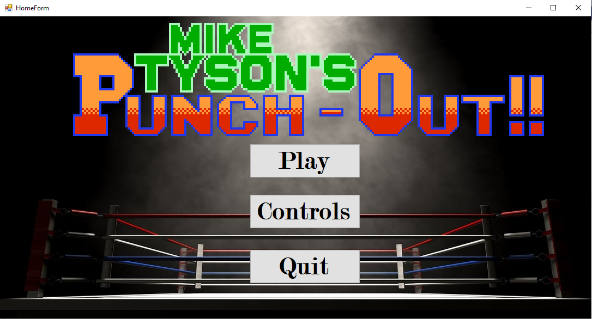
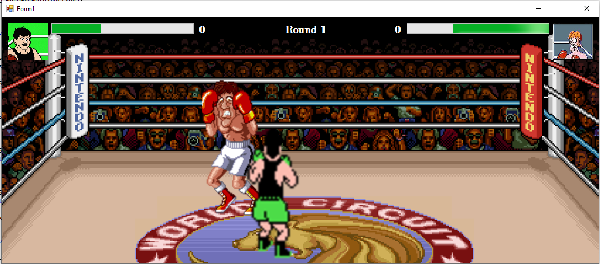

## Проектна задача по Визуелно Програмирање
# Punch-Out

###### Лука Нешевски 181505
Играта е инспирирана од Arcade играта од 80тите Mike Tyson's Punch-Out!
Главната разлика е што е додадено движење на играчот, со попрости акцци кои може да ги прави истиот.

## Како се игра
Играчот може да се движи во 4 насоки, да удари си левата, десната рака како и да блокира, противникот истото.
Истото е сликовно објаснето со кликнување на `Controls` копчето

# Имплементација - Kласи и методи
За боксерите е креиратна апстрактната класа `Boxer`. Во класата се чуваат следните:
 * Слика 
 * Позиција
 * Health (od 0 do 100)
 * STATE (за да може противникот да знае што прави боксерот (IDLE - отворен за напад, LEFT, RIGHT - удар со соодветната рака, BLOCK - блокира)
 * Брзина на движење
 * Покажувач кон противникот
	
како и соодветните класи за движење и извршување на акција(IDLE, BLOCK, LEFT, RIGHT)
	
Секој од боксерите има покажувач кон инстанцата од противникот за повеќе причини:
	
   * Движењето нагоре за играчот е ограничено во самиот ринг, дополнително поради 2D моделите, од горе е ограничен според позицијата на противникот (не може да се наоѓа погоре од противникот)
   * Движењето надолу за противникот е ограничено исто како и играчот, освен тоа што сега тој е ограничен за движење надолу во однос на играчот
   * `STATE` на противникот да се знае
   * Да ја знае позицијата на противникот (која се користи во методата `inRange`)
   * Да може да се одземе Health од противникот доколку ударот е успешетн (доволно е блиску и противникот не блокира, односно `STATE` не е `BLOCK`
		
Од апстракната класа `Boxer` наследуваат `Player` и `Enemy` класите.
		
## Методи

Покрај Setters и Getters, постојат и други методи:

 * Методи за движење 'MoveUp()' 'MoveDown()' 'MoveLeft()' 'MoveRight()'
 * `InRnage()` - која користи позицијата од пријателот за да најде дали е доволно блозу за успешен удар (40 пикслеи апсолутна разлика по X и Y).
 * `isDead()` дали Health e 0
 * `TakeDamage()` - повикана од противникот 
 ### `Scene`
 Двата боксери се дел од `Scene` класата, преку која се контролира играта.
 Главно се повикуваат методите за движење на боксерите.
 
 # Форми
 Има 2 форми во проектот, `HomeForm` и `Form1`
 
 ### HomeForm
 
 
 
 Главната форма која што се инстанцира кога се пушти играта. Тука се чува и инстанцира `Form1`
 Се прикажува почетната страница со 3 `Buttons`:
  * `Play` - се инстанцира `Form1`
  * `Controls` - се прикажуваат контролите за движење/акции
  * `Quit` - се гаси играта
 ### Form1
 
 
 
 Главната форма на која што се овозможува да се игра играта.
 Позадината е ринг со публика, со "псевдоанимаицја" која што со помош на `Timer` разменува помеѓу 4 слики кои што имаат разлики во публиката, со помош на променлива `backgroundNum`, што овозможува илузија на жива публика
 
 	private void backgroundAnimationTimer_Tick(object sender, EventArgs e)
        {
            switch(this.backgroundNum)
            {
                case 1:
                    this.BackgroundImage = Resources.ringA;
                    this.backgroundNum++;
                    break;
                case 2:
                    this.BackgroundImage = Resources.ringB;
                    this.backgroundNum++;
                    break;
                case 3:
                    this.BackgroundImage = Resources.ringC;
                    this.backgroundNum++;
                    break;
                case 4:
                    this.BackgroundImage = Resources.ringD;
                    this.backgroundNum = 1;
                    break;               
            }
        }
	
Акциите на `Enemy` се рандом со помош на `Timer` и `Random`:
  Движењето е униформно со 0.25 веројатност за секој од 4-те насоки (горе,долу,лево,десно)
  Акциите се со следна дистрибуција: 
 * 0.3 веројатност да стои со спуштени раце (IDLE State)
 * 0.4 веројатнст да блокира (BLOCK State)
 * 0.15 веројатност за удар
     Имплементирано со помош на `Random` со генерирање на број во рангот (1,101)
	
 	private void enemyStateTimer_Tick(object sender, EventArgs e)
        {
            int state = this.enemyStateGenerator.Next(1, 101);
            if (state <= 30)
            {
                Scene.changeEnemyState(Boxer.STATE.IDLE);
            }
            else if (state <= 70)
            {
                Scene.changeEnemyState(Boxer.STATE.BLOCK);
            }
            else if (state <= 85)
            {
                Scene.changeEnemyState(Boxer.STATE.LEFT);
                this.PlayerHealthBar();
            }
            else
            {
                Scene.changeEnemyState(Boxer.STATE.RIGHT);
                this.PlayerHealthBar();
            }
        }
Рундата завршува кога еден од боксерите ќе имаат `Health` 0.
Играчот се известува за крајот на рундата и со `MessageBox` избира дали сака да игра повторно или не.
Доколку избере `Yes` со тоа што:
   * Бројот на рундата се зголемува во средина горе.
   * Се зголемува за 1 бројот на победеи рунди за боксерот кој што предходно победил.
   
Доколку се избере `No` се враќа кон `HomeForm`.
